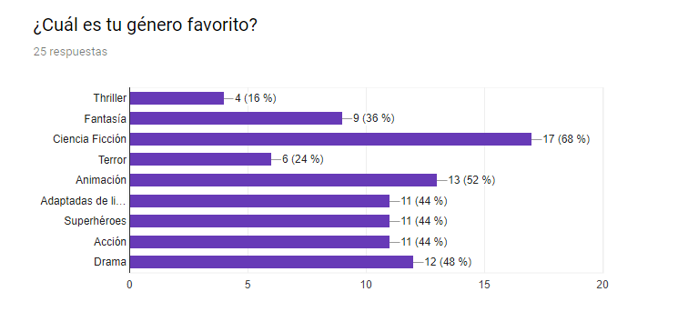
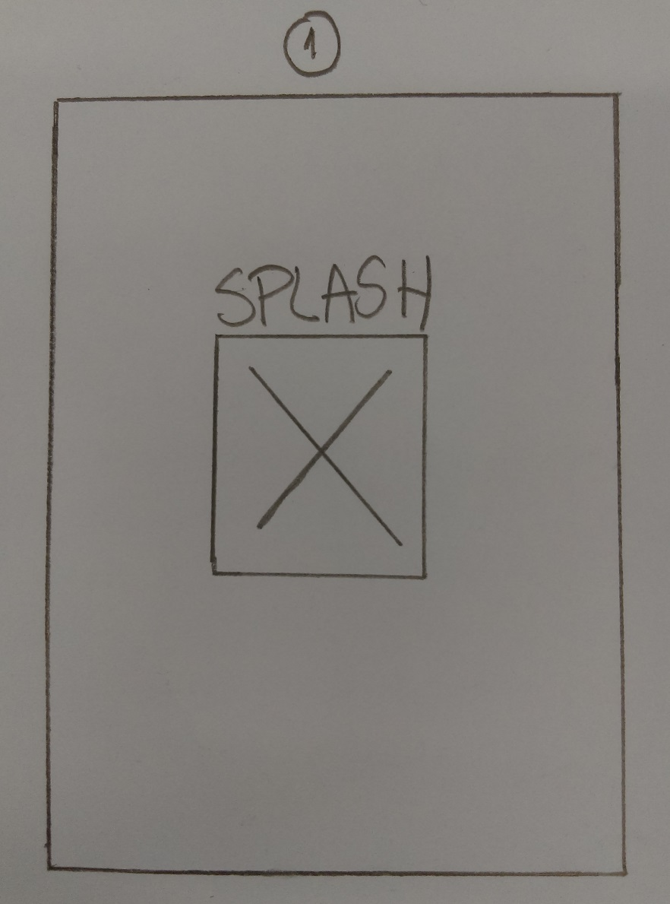
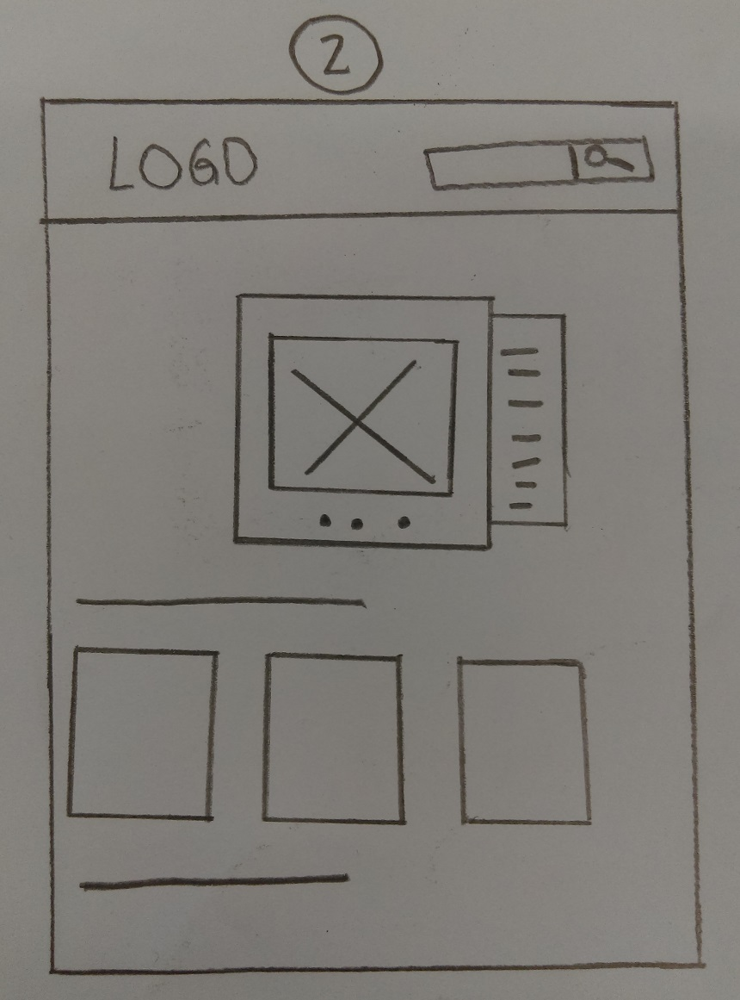

# TIM BURTON 

## **Presentación del producto**

Tim Burton's Lovers es una aplicación en la que los fanáticos y seguidores de Tim Burton, reconocido director y productor estadounidense, podrán realizar fácilmente búsquedas de todas sus películas y conocer detalles de cada una de ellas. Además de conocer un poco mas acerca de él, su biografía, carrera, etc. 

### **Validación de la idea**

Para validar la idea se empleó una encuesta a 25 personas para conocer preferencias de películas y director de cine favorito. A continuación se muestran los resultados:

+ De acuerdo a los resultados obtenidos, 40% de los encuestados respondieron que Tim Burton es su director favorito. Además el 56% tiene por película preferida El hombre manos de tijera, una de las más reconocidas de Tim Burton.

### **Planificación del proyecto:** 

+ Para la planificación del proyecto utilizamos un  _board_ en **Trello**: [visita nuestro tablero aquí](https://trello.com/b/LPK3sIs0/flujo-de-trabajo-del-proyecto).

#### Detalle de tareas asignadas:

+ Martes 16 de enero de 2018

| Actividad  | Tiempo | Encargadas  |
| ---------- | ---------- | ---------- |
| Ideación y sketch del proyecto. Definición de la temática del producto. | 8:30 a 10:30 a.m.  | Todo el equipo  |
| Crea repositorio con estructura de archivos y carpetas. Inicia desarrollo de vista splash de varias imágenes. | 10:35 a 12:40 p.m.  | Ana Lorena   |
| Ideación línea de tiempo Tim Burton's lovers e investigación para su desarrollo. | 10:35 a 12:40 p.m.  | Tahirih   |
| Avance Readme, iniciar maquetación vista bio y creación de tablero en Trello. | 10:35 a 12:40 p.m.  | Lucero  |
| Iniciar maquetación vista home e investigación para desarrollar slider de la forma más óptima. Preparación de encuesta de investigación  | 10:35 a 12:40 p.m.  | Patricia  |
| Retrospectiva.  | 12:40 a 1:00 p.m.  | Todo el equipo  |

+ Miércoles 17 de enero de 2018

| Actividad  | Tiempo | Encargadas  |
| ---------- | ---------- | ---------- |
| Daily | 8:00 a 8:20 a.m.  | Todo el equipo  |
| Subir avance, desarrollo de slider (al hacer scroll), avance de vista home| 8:20 a 12:40 p.m.  | Ana Lorena   |
| Subir avance. Desarrollo de línea de tiempo filmográfica de Tim Burton | 8:20 a 12:40 p.m.  | Tahirih   |
| Subir avance, investigación acerca de OMDB API. Comienzo de funcionalidad de búsquedas. | 8:20 a 12:40 p.m. | Lucero  |
| Subir avance, actualizar README e incluir resultados de encuesta.  | 8:20 a 12:40 p.m. | Patricia  |
| Primera presentación del proyecto ante el equipo evaluador.  | 11:20 a 11:35 a.m.  | Patricia y Ana Lorena |
| Retrospectiva.  | 12:40 a 1:00 p.m.  | Todo el equipo  |

+ Jueves 18 de enero de 2018

| Actividad  | Tiempo | Encargadas  |
| ---------- | ---------- | ---------- |
| Daily | 8:00 a 8:20 a.m.  | Todo el equipo  |
| Terminar maquetación vista home, diseño de modales, subir avance | 8:20 a 12:40 p.m. | Ana Lorena   |
| Terminar detalles de la línea del tiempo, añadir modales conteniendo data de la API, subir avance. | 8:20 a 12:40 p.m.  | Tahirih   |
| Subir avance, funcionalidad del input búsqueda de películas de Tim Burton. | 8:20 a 12:40 p.m.  | Lucero  |
| Desarrollo maquetación vista bio, actualizar README, subir avance. | 8:20 a 12:40 p.m. | Patricia  |
| Retrospectiva.  | 12:40 a 1:00 p.m.  | Todo el equipo  |

+ Viernes 19 de enero de 2018

| Actividad  | Tiempo | Encargadas  |
| ---------- | ---------- | ---------- |
| Daily | 8:00 a 8:20 a.m.  | Todo el equipo  |
| Ultimar detalles del MVP, últimos commits, coordinaciones finales. | 8:20 a 10:00 a.m.  | Todo el equipo  |
| Presentación del mínimo producto viable ante el equipo evaluador.  | 10:00 a.m.  | Tahirih y Lucero  |

### **Producto Mínimo Viable**

+ Los usuarios podrán buscar por título las película de Tim Burton de su preferencia, y obtendrán detalles de la misma mediante un modal, la data es obtenida de OMDB API.

+ Línea del tiempo de su carrera cinematográfica.

+ Vista slider (al hacer scroll) con información relevante de su carrera y frases emblemáticas.

+ Nueva vista con información sobre su bibliografía y datos curiosos.

### **Lineamientos Básicos:**

* Como parte de la Hackaton interna del bootcamp de Laboratoria Lima 2017-2 se  desarrollará un producto usando información de películas.

* Estos son los lineamientos básicos:

  1. Emplear el API de Open Movie Database (OMDB) para manipular data de películas.

  2. Presentar el proyecto en un link (que no sea un local host).

  3. Trabajar colaborativamente en [github](https://github.com/AnaLorenaDiaz/timburton-lovers).

  4. Presentar la mayor cantidad de funcionalidades completas.

  5. El squad debe escoger el tema en el cual estará basado su producto según la base datos proporcionada.

### **Flujo de Trabajo:**

* Desarrollamos un sketch de las dos vistas principales:

  

  

* Emplearemos los siguientes recursos:

    1. The open movie database (OMDB API)

    2. Framework Bootstrap 3.3.7

    2. Librería de jquery

    3. HTML5 y CSS3

  ### **Desarrolladoras del Proyecto:**

  * Ana Lorena Díaz.

  * Tahirih Jaliri.

  * Patricia Urco.

  * Lucero Hospina.

